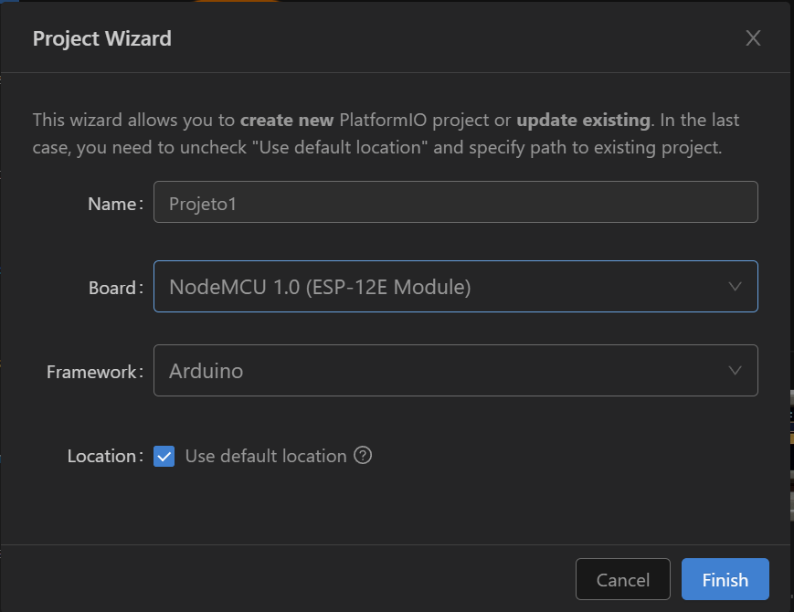
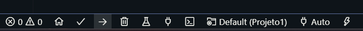
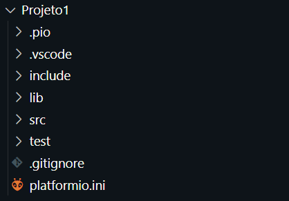
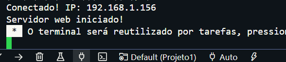
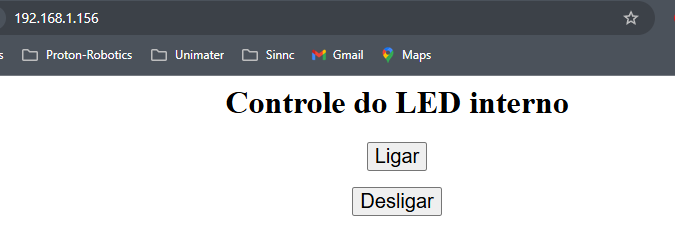

# CONFIGURAÇÃO
- Instale a extensão platform.io


- crie um projeto



Vamos para um teste:

# TESTE

 **ligar e desligar o LED interno do NodeMCU (ESP8266)** usando uma **página web** acessada pelo navegador.

---


- NodeMCU (ESP8266)
- Cabo micro USB
- Wi-Fi com acesso à mesma rede do computador ou celular

---


```cpp
#include <ESP8266WiFi.h>
#include <ESP8266WebServer.h>

const char* ssid = "SSID";       // nome da sua rede Wi-Fi
const char* password = "SENHA"; // senha da rede

ESP8266WebServer server(80);

// LED interno do NodeMCU (geralmente GPIO2 = D4)
const int ledPin = LED_BUILTIN;

void handleRoot() {
  String html = "<html><body style='text-align:center;'>";
  html += "<h1>Controle do LED interno</h1>";
  html += "<p><a href='/on'><button style='font-size:20px;'>Ligar</button></a></p>";
  html += "<p><a href='/off'><button style='font-size:20px;'>Desligar</button></a></p>";
  html += "</body></html>";
  server.send(200, "text/html", html);
}

void handleOn() {
  digitalWrite(ledPin, LOW); // LOW liga o LED interno (ativo em nível baixo)
  server.sendHeader("Location", "/");
  server.send(303);
}

void handleOff() {
  digitalWrite(ledPin, HIGH); // HIGH desliga o LED interno
  server.sendHeader("Location", "/");
  server.send(303);
}

void setup() {
  pinMode(ledPin, OUTPUT);
  digitalWrite(ledPin, HIGH); // começa desligado

  Serial.begin(115200);
  WiFi.begin(ssid, password);
  Serial.print("Conectando ao WiFi");

  while (WiFi.status() != WL_CONNECTED) {
    delay(500);
    Serial.print(".");
  }

  Serial.println();
  Serial.print("Conectado! IP: ");
  Serial.println(WiFi.localIP());

  server.on("/", handleRoot);
  server.on("/on", handleOn);
  server.on("/off", handleOff);

  server.begin();
  Serial.println("Servidor web iniciado!");
}

void loop() {
  server.handleClient();
}
```

- Para mandar o programa é necessário fazer o upload


- Irei explicar em aula como é a estrutura do ambiente:



- Após mandar o programa:


verifique o IP e acesse:


